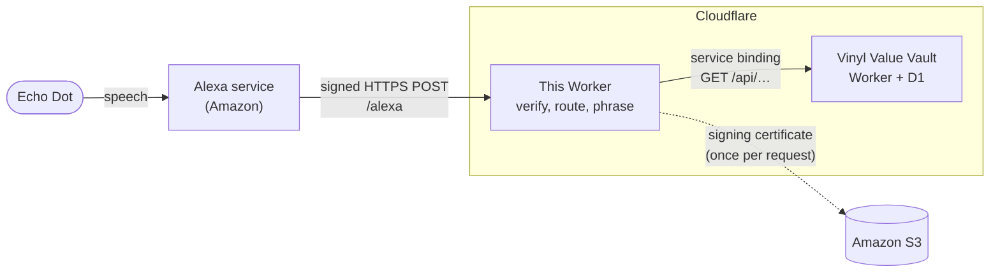

# Vinyl Vault for Alexa

[](https://github.com/JakubMini/vinyl-vault-alexa/actions/workflows/ci.yml)

An Alexa skill for asking an Echo about my record collection: what it is worth, which record is the most valuable, what has gone up, whether I own something, and what to play next. It is the voice front end for [Vinyl Value Vault](https://github.com/JakubMini/vinyl-value-vault), which keeps the collection and its prices. It runs as a Cloudflare Worker and is designed to run for free.

> **Status:** live since 2 October 2026, as a private skill on my own Amazon account. It answers what the collection is worth, which record is the most valuable, what has gone up over the last month, and whether a record is in the collection. Weekly and yearly changes, and recommendations, need more from the vault first; see the [roadmap](#roadmap).

## What it does

You talk to it like this:

> "Alexa, ask vinyl vault what my collection is worth."
> *"Your 163 records are worth about £3,450. 12 of them haven't been priced yet, so the real total is higher."*

Or open it and then ask: "Alexa, open vinyl vault."

| Question | What it says | Status |
| --- | --- | --- |
| "What is my collection worth?" | The total, how many records it covers, and how many are not priced yet | Built |
| "Which record is the most valuable?" | The top record and its value, then the next two | Built |
| "Which records have gained the most value this month?" | The three biggest risers and how much each gained | Built for a month. Asked about a week or a year, it says it can only compare with a month ago for now |
| "Do I have Rumours?" | One match: its grade and value. Several: how many copies, or a list. None: says so | Built |
| "Recommend me a record." | A random record I own, never one of the last ten it suggested | Planned |

**About the wording.** A private Alexa skill has to be called by name, so the question is "Alexa, ask vinyl vault…", not just "Alexa, what is my collection worth?". Name-free questions are only offered to published, certified skills, and even then Alexa decides when to use them. For the fixed questions an [Alexa Routine](#asking-without-the-skill-name) gets close: the phrase "what is my vinyl collection worth" can be set to run "ask vinyl vault what my collection is worth".

The skill says what it does not know. If some records have no price yet, the answer says so. When prices have been tracked for less than a month, "this month" becomes "since 2 October", so the answer never claims more history than there is.

## How it works



1. Alexa turns speech into an **intent**, such as `CollectionValueIntent`, using the interaction model in [`skill-package/`](skill-package/interactionModels/custom/en-GB.json). It then posts the intent to this Worker as signed JSON.
2. The Worker **proves the request came from Alexa** before reading it (see the next section).
3. It looks up the **handler** for the intent and asks the vault for what it needs.
4. It **phrases the answer** for the ear: whole pounds rather than pence, "one record" rather than "1 records", and the caveats that matter. Then it ends the session.

The skill is deliberately thin. Everything worked out from price history, such as totals and each record's change over the last 30 days, and anything stored, lives behind the vault's API. The vault's dashboard uses the same figures. The vault hands back the whole collection in one page, as the dashboard asks for it, and the skill only ranks and matches that list ([`src/collection.ts`](src/collection.ts)):

- **Most valuable** sorts by current value and leaves unpriced records out.
- **Gained the most** sorts by each record's 30-day change and keeps only real gains. The vault's daily totals tell the skill when tracking began, so it can say "since" instead of "over the last month" when history is short.
- **Do I have…** needs every meaningful word of what was heard to appear in the artist or title. Words like "any", "by", "the" or "a copy of" are ignored. Accents and punctuation do not matter, so "bjork" finds Björk. Words of five letters or more may be a letter off, and nine or more two letters off, so speech recognition's "rumors" still finds "Rumours". Discogs' numbering of artists who share a name, such as "Nirvana (2)", is never matched or spoken.
- **Records that have left the Discogs collection** are dropped as soon as the list arrives, so the skill never mentions them.

The skill reaches the vault through a [service binding](https://developers.cloudflare.com/workers/runtime-apis/bindings/service-bindings/): one Worker calling another inside Cloudflare, with no public network hop and no extra cost. The vault still checks its API key on every call.

### Proving a request came from Alexa

The endpoint is a public URL, so anyone could post to it. Amazon requires every skill hosted outside its own Lambda service to check each request, and this one does, in [`src/verify.ts`](src/verify.ts):

- **The certificate comes from Amazon.** The request names where its signing certificate lives. That address must be `https://s3.amazonaws.com/echo.api/…` exactly.
- **The certificate is genuine.** It must be in date and issued to `echo-api.amazon.com`. It must also chain back to one of Amazon's root authorities. Those roots are pinned in the code, each checked against the fingerprints Amazon publishes, rather than taken from whatever the runtime happens to trust.
- **The body is what Amazon signed.** The signature in the request is checked against the raw body with the certificate's public key, so a single changed byte fails it.
- **The request is fresh and meant for this skill.** It must be less than 150 seconds old, which defeats replays, and addressed to this skill's id.

Any failure is a `400`, logged with the reason. There is no bypass and no "development mode". The tests sign real requests with a throwaway certificate authority (see [`scripts/make-test-certs.sh`](scripts/make-test-certs.sh)) and hand that authority to the verifier explicitly. The deployed Worker only ever trusts Amazon's roots, and a test proves it refuses the test certificates.

All the cryptography is the Workers runtime's built-in `node:crypto`: X.509 parsing, chain checks and RSA signature verification. No crypto library is bundled, and the expensive work runs natively rather than in JavaScript, which matters on the free plan's 10 ms CPU budget.

## The stack, and why

| Piece | Choice | Why |
| --- | --- | --- |
| Hosting | [Cloudflare Workers](https://developers.cloudflare.com/workers/) | The vault already runs there, so it is one account, one toolchain and one set of conventions. A service binding makes the vault a function call away. The usual choice, an Alexa-hosted AWS Lambda, would add a second cloud for one endpoint. The cost is implementing Amazon's request verification, which is above. |
| HTTP | [Hono](https://hono.dev/) | The same small, typed router as the vault. |
| Alexa protocol | [Zod](https://zod.dev/), no Alexa SDK | The skill uses a small slice of the request format. Typing that slice with Zod keeps the bundle small and makes unexpected input fail loudly. The vault's responses are checked the same way. |
| Language | TypeScript, strict | Binding types are generated from the Wrangler config. |
| Tests | [Vitest](https://vitest.dev/) with Cloudflare's plugin | Tests run inside the real Workers runtime. The vault binding is a stub, and Amazon's certificate download is mocked with [Mock Service Worker](https://mswjs.io/), so nothing touches the network. |
| Skill definition | [ASK CLI](https://developer.amazon.com/en-US/docs/alexa/smapi/ask-cli-intro.html) | The manifest and interaction model are JSON in this repo and deployed from it, not clicked together in a console. |
| CI | GitHub Actions | Types, typecheck, tests and a dry-run deploy on every pull request. |

## Running it locally

Needs Node 24.

```bash
npm install
cp .dev.vars.example .dev.vars   # then set VAULT_API_KEY to the vault's local API_KEY
npm run dev                      # http://localhost:8787
```

The `VAULT` binding finds the vault when the vault is running in another terminal (`npm run dev` there). An unsigned request to `/alexa` is refused, as it should be, so locally only `/health` answers. Try the skill itself in the tests, or in the Alexa developer console once deployed.

```bash
npm run check   # types, typecheck, tests
```

## Deploying and registering the skill

This happens once, and some steps need my own logins:

1. **The skill.** Sign in at [developer.amazon.com](https://developer.amazon.com) with the Amazon account the Echo uses, and complete the developer registration. Without it the account has no vendor ID, and the CLI stops with "There is no Vendor ID associated with your account". Then log the CLI in with `npx ask-cli configure`, and run `npx ask-cli deploy`. That creates the skill from `skill-package/`. `ask-resources.json` has no infrastructure section, so the CLI only pushes the skill definition and never touches AWS.
2. **The id.** The CLI records the new skill's id in `.ask/ask-states.json`. That file is committed, so later deploys update the same skill instead of creating another. The same id goes in `wrangler.jsonc` as `ALEXA_SKILL_ID`; if that is ever empty, the Worker refuses every request.
3. **The Worker.** Check `npx wrangler whoami` names the personal Cloudflare account. Then run `npx wrangler secret put VAULT_API_KEY` and `npm run deploy`. It deploys to `https://vinyl-vault-alexa.jakub-m-szypicyn.workers.dev`, the endpoint `skill.json` points at.
4. **Test.** Use the developer console's test tab first, then the Echo. A skill in development is available on every device on the developer's own Amazon account, with no publishing needed. The Echo's language must match the skill's locale, English (UK).

After changing utterances or intents, run `npx ask-cli deploy` again. After changing code, run `npm run deploy`.

### Asking without the skill name

In the Alexa app, go to **More → Routines → +**:

- **When this happens:** Voice, "what is my vinyl collection worth".
- **Alexa will:** Customised, "ask vinyl vault what my collection is worth".

This works for any fixed question. It cannot pass a record name through, so "do I have…" still needs "ask vinyl vault".

## How I work on this

- **Nothing lands on `main` directly.** Every change is a branch and a pull request, and CI must pass before merging.
- **Verification is not optional.** Request checks run before anything else. Each check has a test that fails if the check is removed, and the certificate address rules are tested against Amazon's own examples of good and bad URLs.
- **The interaction model and the code move together.** A test fails if an intent in the model has no handler, or a handler has no intent.
- **Tests run in the real runtime**, against a stub vault and a mocked network.
- **Secrets never enter the repo.** `.dev.vars` locally, `wrangler secret put` in production.
- **This README is kept true.** A change to the architecture, the questions, the setup or the roadmap updates it in the same pull request.
- **AI-assisted.** I build this with Claude Code as a pair programmer. The design decisions, reviews and merges are mine.

## Project layout

```
src/
  index.ts         Worker entry: the app, trusting Amazon's roots
  app.ts           routes: /health, and /alexa (verify, parse, answer)
  verify.ts        proving a request came from Alexa
  amazon-roots.ts  the pinned Amazon root certificates
  envelope.ts      the Alexa request and response format, typed with Zod
  intents.ts       one handler per intent: what the skill says
  collection.ts    ranking and matching the record list: most valuable, risers, "do I have"
  vault.ts         the vault API client, over the service binding
  speech.ts        money, counts, lists, grades, dates and names, phrased for the ear
skill-package/     the skill manifest and interaction model, deployed with the ASK CLI
scripts/           make-test-certs.sh: the throwaway CA the tests sign with
test/              Vitest suites running inside workerd; fixtures/certs holds the test chain
wrangler.jsonc     Worker config: the vault binding, the skill id
```

## Roadmap

- [x] The endpoint: request verification, and "what is my collection worth?"
- [x] Register the skill and deploy
- [ ] Vault: value changes over a week or a year as well as 30 days, and a log of recommendations ([vinyl-value-vault](https://github.com/JakubMini/vinyl-value-vault))
- [x] "Which record is the most valuable?"
- [x] "What has gained the most value this month?"
- [ ] Weekly and yearly changes, and "what has lost the most?" (needs the vault to report changes over other periods)
- [x] "Do I have …?"
- [ ] "Recommend me a record"
- [ ] Better recognition of record names: feed the collection's artists and titles into the interaction model
- [ ] "…and that's up £120 this month" on the collection total
- [ ] Cards with cover art in the Alexa app

## Licence

No licence yet, all rights reserved. Feel free to read and learn from it; ask before reusing.
